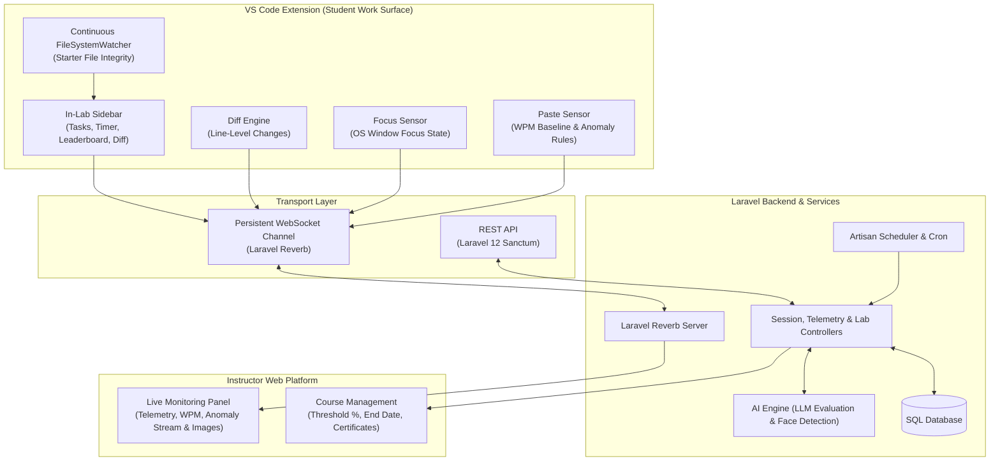

# CertiCode Labs

> **Next-Generation AI-Proctored Programming Laboratory & Assessment Platform**  
> Integrated seamlessly with the **CertiCode Labs VS Code Extension**, **Laravel 12 Backend**, **Laravel Reverb WebSockets**, and **Instructor Live Monitoring Dashboard**.

---

## Table of Contents
- [Overview](#overview)
- [Core Features & Architecture](#core-features--architecture)
  - [1. Lab Availability Modes: Live Lab vs. Open Lab](#1-lab-availability-modes-live-lab-vs-open-lab)
  - [2. Real-Time Line Diff Tracking](#2-real-time-line-diff-tracking)
  - [3. Collaborative Team Chat & Ephemeral Storage](#3-collaborative-team-chat--ephemeral-storage)
  - [4. AI Proctoring & Anomaly Telemetry](#4-ai-proctoring--anomaly-telemetry)
  - [5. Camera Presence Gate & Continuous Verification](#5-camera-presence-gate--continuous-verification)
  - [6. In-Lab VS Code Sidebar & Live Leaderboard](#6-in-lab-vs-code-sidebar--live-leaderboard)
  - [7. Instructor Live Monitoring Panel](#7-instructor-live-monitoring-panel)
  - [8. Session Closure, Course Competency & E-Certification](#8-session-closure-course-competency--e-certification)
- [System Architecture](#system-architecture)
- [Getting Started](#getting-started)
  - [Prerequisites](#prerequisites)
  - [Installation](#installation)
  - [Environment Configuration](#environment-configuration)
  - [Running the Local Development Stack](#running-the-local-development-stack)
- [VS Code Extension](#vs-code-extension)
  - [Installing Pre-built VSIX](#installing-pre-built-vsix)
  - [Building from Source](#building-from-source)
- [Automated Testing](#automated-testing)
- [Production & Cloud Deployment](#production--cloud-deployment)
  - [Vercel Serverless & Cron Execution](#vercel-serverless--cron-execution)
- [License](#license)

---

## Overview

**CertiCode Labs** is an intelligent coding lab and proctoring platform designed to evaluate programming competencies in realistic IDE environments. Rather than confining students to basic web code editors, CertiCode Labs connects directly to **Microsoft VS Code** via a dedicated companion extension while streaming real-time telemetry, line-level contributions, and live leaderboards back to the instructor dashboard.

---

## Core Features & Architecture

### 1. Lab Availability Modes: Live Lab vs. Open Lab
Instructors configure lab accessibility independently of participation mode (Solo or Team):
* **Live Lab**:
  * Inaccessible to students until the instructor manually opens it (`openLive`).
  * Runs on a **shared synchronous countdown timer** for all students simultaneously.
  * Late joiners receive only the remaining window time.
  * When the timer expires, all active sessions are auto-submitted and closed; late joiners are strictly blocked (`live_expired`).
  * If reopened, countdown resumes with leftover time only, unless explicitly extended with additional minutes.
* **Open Lab**:
  * Self-paced; available immediately upon creation throughout active course duration.
  * Individual per-student timer begins when the student initiates the lab.
  * Closes only when individually submitted, manually ended by instructor, or when the entire course concludes.

### 2. Real-Time Line Diff Tracking
* Calculates line-level deltas (`+added`, `-deleted`, `~modified`) against the original starter file baseline in real time.
* **Solo Mode**: Tracks personal diff stats and displays compact diff counters in the VS Code sidebar.
* **Team Mode**: Provides line-level `git blame`-style attribution per teammate with avatar colors and contribution percentages.
* **Transport**: Streams over persistent WebSocket channels (`DiffUpdated`) with automatic REST fallback.

### 3. Collaborative Team Chat & Ephemeral Storage
* Embedded in the VS Code sidebar and web platform exclusively during team exercises.
* Partitioned strictly by `group_id` and `lab_session_id`.
* **Ephemeral Lifecycle**: Auto-cleared and purged from the database immediately upon session completion.

### 4. AI Proctoring & Anomaly Telemetry
* **WPM Behavioral Baseline**: Tracks continuous typing speed over rolling time windows.
* **Smart Paste Anomaly Detection**:
  * **Suppression Rule A**: Ignores paste if content matches existing text elsewhere in the same file (internal move/restructure).
  * **Suppression Rule B**: Ignores paste if content matches recent snippets from the active team chat.
  * **Contextual AI Validation**: Flags unsuppressed external pastes to the instructor panel without interrupting the student.
* **Focus-Lost Tracking**: Hooks OS-level VS Code window focus (`onDidChangeWindowState`), ignoring sidebar tab switches.

### 5. Camera Presence Gate & Continuous Verification
* **Pre-Lab Gate**: Requires browser webcam permission and passes AI face detection before the lab workspace is unlocked.
* **Continuous Background Proctoring**: Performs non-interruptive periodic background presence checks. Mid-session face-loss alerts are quietly streamed to the instructor with snapshot attachments while the student continues working.

### 6. In-Lab VS Code Sidebar & Live Leaderboard
* Live session timer countdown synced with backend.
* Task checklists with completion statuses and instant AI compiler/runtime feedback.
* **Task Failure Rule**: If code contains compiler/runtime errors, the task is marked failed automatically.
* **Live Leaderboard**: Displays rank ordered by tasks completed (descending) with completion time as the tiebreaker.

### 7. Instructor Live Monitoring Panel
* Roster view sortable alphabetically by student last name or team group name.
* Live metric stream displaying real-time WPM, completed task counters, and team contribution percentages.
* Comprehensive chronological anomaly timeline with captured camera snapshot previews.

### 8. Session Closure, Course Competency & E-Certification
* **Lab Closure**: Auto-submits pending workspaces, assesses competency scores, terminates WebSocket channels, and purges chat.
* **Course Completion**: Evaluates cumulative competencies across all labs against an instructor-configured passing threshold percentage (e.g. 75%).
* **E-Certification**: Automatically issues verifiable cryptographic certificates with QR codes for qualifying students upon course conclusion.

---

## System Architecture



---

## Getting Started

### Prerequisites
* **PHP 8.2+** (with `bcmath`, `curl`, `mbstring`, `pdo_sqlite` or `pdo_mysql`, `fileinfo`)
* **Composer 2+**
* **Node.js 18+** & **npm 9+**
* **Microsoft VS Code** (version 1.75.0 or later)

### Installation

1. **Clone the repository**:
   ```bash
   git clone https://github.com/vhengie02/Certicode-Labs.git
   cd "Certicode Labs"
   ```

2. **Install PHP dependencies**:
   ```bash
   composer install
   ```

3. **Install JavaScript dependencies**:
   ```bash
   npm install
   ```

4. **Prepare Environment File**:
   ```bash
   cp .env.example .env
   php artisan key:generate
   ```

5. **Run Database Migrations & Symlink Storage**:
   ```bash
   php artisan migrate
   php artisan storage:link
   ```

---

### Environment Configuration

Key variables in `.env`:

```ini
# Application URL
APP_URL=http://localhost:8000

# Database
DB_CONNECTION=sqlite

# WebSockets (Laravel Reverb)
BROADCAST_CONNECTION=reverb
REVERB_APP_ID=certicode-app
REVERB_APP_KEY=certicode-key
REVERB_APP_SECRET=certicode-secret
REVERB_HOST=127.0.0.1
REVERB_PORT=8080
REVERB_SCHEME=http

# Client-Side Vite Broadcast Config
VITE_REVERB_APP_KEY="${REVERB_APP_KEY}"
VITE_REVERB_HOST="${REVERB_HOST}"
VITE_REVERB_PORT="${REVERB_PORT}"
VITE_REVERB_SCHEME="${REVERB_SCHEME}"

# AI Evaluation Engine
OPENAI_API_KEY=your-openai-api-key

# Cron Security Token (Used by Vercel Cron / Cloud Scheduler)
CRON_SECRET=your-secure-cron-token
```

---

### Running the Local Development Stack

Run each component in a separate terminal window:

```bash
# 1. Laravel Web Application
php artisan serve

# 2. WebSocket Server (Reverb)
php artisan reverb:start

# 3. Frontend Asset Bundler
npm run dev

# 4. Background Scheduled Tasks (auto-close expired live labs & conclude classes)
php artisan schedule:work
```

---

## VS Code Extension

The companion extension enables students to code in their native VS Code editor with starter files, live task checklists, diff pill counters, and proctoring telemetry.

### Installing Pre-built VSIX
The pre-compiled extension package (**v1.1.0**) is maintained in `public/downloads/certicode-labs.vsix`:

```bash
code --install-extension public/downloads/certicode-labs.vsix --force
```

### Building from Source
To compile and package the extension manually:

```bash
cd certicode-labs-extension
npm install
npx tsc -p ./
npx @vscode/vsce package -o ../public/downloads/certicode-labs.vsix
```

---

## Automated Testing

CertiCode Labs includes a comprehensive test suite of **131 tests (563 assertions)** covering:
* Live Lab availability lifecycle, synchronous countdowns, and late-joiner gating
* Pre-lab camera face detection gates and continuous proctoring
* OS focus loss and typing anomaly telemetry
* Real-time WebSocket broadcasting events
* Course conclusion and certificate issuance
* Multi-file starter code synchronization and REST fallback

Run the test suite:
```bash
php artisan test
```

---

## Production & Cloud Deployment

### Vercel Serverless & Cron Execution
The repository includes a production-ready `vercel.json` configuration:
* **Serverless PHP Runtime**: Routes web requests through `api/index.php`.
* **Static Assets**: Automatically maps `/build/*` and `/downloads/*` (direct `.vsix` distribution).
* **Automated Vercel Crons**: Configured to poll `/api/cron/tick` every minute:
  ```json
  "crons": [
    {
      "path": "/api/cron/tick",
      "schedule": "* * * * *"
    }
  ]
  ```
  The `/api/cron/tick` endpoint executes:
  1. `certicode:close-expired-live-labs`
  2. `certicode:auto-conclude-expired-classes`

---

## License

This project is licensed under the [MIT License](LICENSE).
