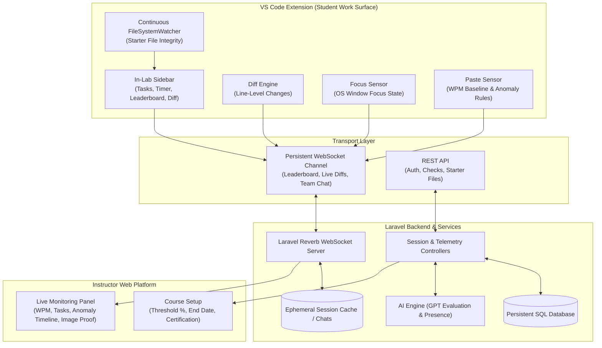

# CertiCode Labs — Project To-Do & Feature Roadmap

This document outlines the final feature specifications, implementation tasks, architectural requirements, and progress across the CertiCode Labs platform (VS Code Extension, Laravel Backend, and Instructor Web Dashboard).

---

## 📋 Feature Roadmap Summary (Final Specification)

| Feature | Primary Scope | Status | Transport / Protocol |
| :--- | :--- | :--- | :--- |
| **1. Diff Tracking** | VS Code Extension, Backend & Dashboard | 🟡 In Progress | WebSocket (Solo & Team) |
| **2. Team Chat** | Extension & Web Platform (Team Mode Only) | 🟡 In Progress | WebSocket |
| **3. Auto-Generated Starter Files** | Extension & Instructor Dashboard | ✅ Completed | REST + Local FileSystemWatcher |
| **4. Paste Anomaly Detection** | Extension, Backend & Telemetry Sensor | ✅ Completed | WebSocket / REST Telemetry |
| **5. In-Lab Sidebar (Leaderboard, Tasks, Timer, Focus)** | VS Code Extension & Backend | ✅ Completed | WebSocket (Solo & Team) |
| **6. Instructor Live Monitoring Panel** | Web Platform (Instructor-Facing) | ✅ Completed | Live Telemetry & Polling Stream |
| **7. Session Closure vs. Course Completion & Certification** | Backend, Web Platform & Database | ✅ Completed | REST + Lifecycle Evaluation |
| **8. Camera Presence Check** | Pre-Lab Gate & Ongoing Proctoring | ✅ Completed | WebRTC / Video Capture + AI |
| **9. Lab Availability Modes (Live Lab vs. Open Lab)** | Backend, Web Platform & VS Code Extension | ✅ Completed | REST + Shared Live Window & Scheduled Cron |

---

## Feature 1: Diff Tracking

### Specification
- **Trigger**: Student edits any file in the lab workspace.
- **Baseline**: Instructor-provided starter file for the exercise.
- **Solo Mode**: Track lines added/removed by the student only.
- **Team Mode**: Track lines added/removed per teammate, attributed at the line level (`git blame` style).
- **Transport**: WebSocket for both modes — solo-mode diff data rides the same WebSocket connection already open for the leaderboard (Feature 5), rather than separate REST polling.
- **Output Destinations**: VS Code sidebar (live view), instructor analytics dashboard (aggregated + per-student view).
- **Dependencies**: Requires authenticated student identity per edit (for team attribution).

### Technical Requirements & Progress
- [x] **Snapshot Baseline Caching ([`sidebarProvider.ts`](file:///C:/Users/vheng/PROJECTS/Certicode%20Labs/certicode-labs-extension/src/sidebarProvider.ts))**:
  - In-memory starter file snapshot baseline created immediately on workspace generation.
- [x] **Line Diff Calculation Engine**:
  - Calculates line-level delta (`+added`, `-deleted`, `~modified`) relative to original starter snapshots on document edit/save.
- [x] **Sidebar Diff View & Pill Counters**:
  - Compact diff pill counter (`+X / -Y`) in sidebar header.
  - Dedicated "Diff View" tab with per-file breakdown and aggregate stats.
- [x] **Team Attribution & Line-Level Blame Data Model**:
  - Tags change blocks with user ID, name, initials, and assigned avatar color.
  - Backend schema: `diff_stats` and `code_contributions` JSON columns in `lab_sessions` table.
- [x] **Instructor Dashboard Visualization**:
  - Visual breakdown per student in team sessions on the web platform (percentage bars, lines added/deleted).
- [ ] **Transport Unification (WebSocket for Solo & Team)**:
  - Migrate solo-mode diff transport from REST `POST /sessions/{id}/diff` polling to stream directly over the existing shared WebSocket connection used for the live leaderboard (Feature 5).
- [ ] **Real-Time Instructor Analytics Stream**:
  - Broadcast line-level diff updates over WebSocket to instructor live dashboard for instant real-time telemetry updates.

---

## Feature 2: Team Chat

### Specification
- **Applies to**: Team-mode exercises only. Not present in solo mode.
- **Team Assignment**: Instructor-defined at exercise creation (instructor sets `mode = solo | team`, and assigns members if team).
- **Visibility**: Private to the student's own team. Instructor has no access to content.
- **Persistence**: Cleared on session end. Not stored beyond session lifetime (ephemeral lifecycle).
- **Transport**: WebSocket.
- **Surfaces**: VS Code sidebar panel + web platform.

### Technical Requirements & Progress
- [x] **Instructor Team Configuration**:
  - Exercise mode flag (`solo` vs `team`) and group assignment schema in instructor dashboard.
- [x] **Conditional Extension UI**:
  - Team Chat tab rendered in VS Code sidebar exclusively during team-mode lab sessions; hidden in solo mode.
- [x] **Privacy Enforcement**:
  - Chat channels partitioned by `group_id` / `lab_session_id`.
  - Instructor live feeds and grading panels strictly exclude chat content.
- [x] **Ephemeral Storage & Lifecycle**:
  - Chat table `lab_session_chats` keyed to `lab_session_id`.
  - Auto-cleared / cascade-deleted upon session termination.
- [x] **Sidebar Chat Component**:
  - Unread message badge, sender initials/color, timestamp formatting, code snippet attachment syntax styling.
- [x] **Web Platform Chat Integration**:
  - Embedded chat panel in `resources/views/laboratories/show.blade.php`.
- [ ] **WebSocket Broadcast Integration**:
  - Migrate chat synchronization to low-latency WebSocket broadcasting (Laravel Reverb) across both extension and web surfaces.

---

## Feature 3: Auto-Generated Starter Files

### Specification
- **Trigger**: Student starts an exercise.
- **Config Source**: Instructor-defined per exercise — includes file count (1 or more), filenames, folder structure, and optional pre-filled content (sample code / comments).
- **Separation of Concerns**: Task instructions live in a dedicated sidebar field (not in-file). In-file content (sample code/comments) is separate and optional.
- **Submission Validation Rule**: Exact filenames required.
- **Validation Mode**: Continuous. The extension watches the workspace via a file-system watcher for the full duration of the session — not just at submit time.
- **Enforcement Rule**: IF expected file is missing/renamed/deleted at any point → show inline warning immediately, naming the specific file → disable Submit button until resolved.

### Technical Requirements & Progress
- [x] **Exercise Schema Multi-File Support**:
  - Added `starter_files` JSON column to `laboratories` table (`[{"name": "...", "content": "...", "is_primary": bool, "is_readonly": bool}]`).
- [x] **Instructor Dashboard Exercise Editor**:
  - Dynamic multi-file manager in `create.blade.php` and `edit.blade.php` with primary file selector and readonly toggles.
- [x] **Workspace File Provisioning**:
  - Automatically provisions starter files in student's active workspace folder upon session connect.
  - Automatically opens primary file in active editor tab.
- [x] **Continuous Client-Side FileSystemWatcher ([`sidebarProvider.ts`](file:///C:/Users/vheng/PROJECTS/Certicode%20Labs/certicode-labs-extension/src/sidebarProvider.ts))**:
  - Registered `vscode.workspace.createFileSystemWatcher` monitoring additions, deletions, and renames.
  - Verifies presence and exact naming of all expected starter files against the manifest for the entire session.
- [x] **Inline Warning & Reactive CTA Locking**:
  - Renders inline warning in sidebar naming missing/renamed files (`Missing: <filename> — this file is required for submission`).
  - Automatically disables Submit button while file structure is invalid.
- [x] **Separation of Concerns**:
  - Instructions, rubrics, and task objectives remain in sidebar; workspace files contain only runnable code/comments.

---

## Feature 4: Paste Anomaly Detection

### Specification
- **Signal 1**: WPM tracked continuously as a behavioral baseline.
- **Signal 2**: Paste event detected (block of code appears without incremental typing).
- **Suppression Rule A (Internal Move/Restructure)**: IF pasted content matches text that already existed elsewhere in the same file → do NOT flag.
- **Suppression Rule B (Permitted Collaboration)**: IF pasted content matches recent content from the team chat → do NOT flag.
- **Flagging Rule**: IF paste is external AND fails both suppression checks → run AI comparison against exercise context to confirm it's not a false positive → THEN flag.
- **Flag Visibility**: Instructor only. Never shown to student.
- **Flag Scope**: Session-scoped. Does not persist or accumulate across sessions.

### Technical Requirements & Progress
- [x] **Continuous WPM Behavioral Tracker (Extension)**:
  - Track keystrokes over moving time window to establish real-time WPM baseline in editor.
- [x] **Paste Event Interceptor**:
  - Hook `vscode.workspace.onDidChangeTextDocument` to detect multi-character insertion blocks appearing within a single tick.
- [x] **Suppression Rule A (Internal File Match)**:
  - Check inserted block against pre-existing document text buffers or baseline snapshot; ignore if content was moved or duplicated internally.
- [x] **Suppression Rule B (Team Chat Match)**:
  - Check inserted block against local session team chat buffer (snippets sent within last N minutes); ignore if content originated from active team chat.
- [x] **Anomaly Telemetry & Contextual Verification Endpoint**:
  - Endpoint `/api/v1/sessions/{id}/telemetry` logging `paste_anomaly` with length, snippet metadata, and rolling WPM.
- [x] **Session-Scoped Anomaly Logging**:
  - Record confirmed paste anomalies in `anomalies` table (`type = paste_anomaly`, `severity = medium|high`, `metadata`).
  - Ensure lifecycle is bounded strictly to session duration (flushed/reset across sessions).
- [x] **Student Blindness Enforcement**:
  - Suppress any indicator of paste flags in the extension sidebar and student dashboard; surface solely on instructor views.

---

## Feature 5: In-Lab Sidebar (Live Leaderboard, Tasks, Timer, Focus Tracking)

### Specification
- **Location Constraint**: All live in-session UI (leaderboard, task list, timer) is rendered in the VS Code sidebar — NOT a browser tab (active student work surface is VS Code).
- **Leaderboard**:
  - **Visibility**: All students (not instructor-only).
  - **Ranking Metric**: Tasks completed.
  - **Tiebreaker**: Time taken to finish.
  - **Update Mode**: Live, via WebSocket.
  - **Scope**: Applies to BOTH solo and team labs — solo labs hold a WebSocket connection specifically for this (and carry diff data, per Feature 1).
- **Task Failure Rule**: IF submitted code contains errors → mark task as failed automatically, regardless of completion attempt.
- **Focus / Anomaly Tracking**:
  - **Signal Used**: VS Code window OS-level focus state (`vscode.window.onDidChangeWindowState`).
  - **Flag Condition**: VS Code loses OS focus (student switched to another application or window).
  - **Non-Condition**: Switching between panels inside the VS Code sidebar (task list ↔ chat ↔ leaderboard ↔ diff view) — internal navigation, never flagged.

### Technical Requirements & Progress
- [x] **Core In-Lab Sidebar Layout**:
  - Session timer countdown/elapsed display synced with backend.
  - Task checklists with completion statuses (Done/Pending) and AI feedback.
- [x] **Sidebar Leaderboard Tab**:
  - Add "Leaderboard" tab in VS Code sidebar webview displaying all session students/teams with rank, tasks count, and elapsed time.
- [x] **Live Leaderboard Channel**:
  - Persistent channel & endpoint (`/sessions/{id}/leaderboard`) across both solo and team lab sessions.
  - Auto-rank by tasks completed (descending) with completion time as tiebreaker (ascending).
- [x] **Strict Task Failure on Code Errors**:
  - Evaluate compiler/runtime output during code execution: if errors occur, auto-mark active task as failed regardless of user attempt.
- [x] **OS-Level Focus Loss Detection**:
  - Register `vscode.window.onDidChangeWindowState` in extension host.
  - Trigger telemetry anomaly event (`type = focus_lost`) when `window.focused` transitions to `false`.
- [x] **Internal Navigation Whitelist**:
  - Ensure sidebar tab switching (Tasks ↔ Chat ↔ Leaderboard ↔ Diff) remains purely webview-internal and does not trigger window focus-lost events.

---

## Feature 6: Instructor Live Monitoring Panel (Browser, Instructor-Facing)

### Specification
- **Location**: Web platform, not VS Code.
- **Scope**: Per lab session. Lists all students (solo) or teams (team mode) in that session.
- **Sort Options**: Alphabetical by last name; alphabetical by group name.
- **Per-Student/Team Detail View (on click)**:
  - Live WPM baseline & current rate.
  - Tasks completed count.
  - Full anomaly history for the session (not just latest): camera-absence events (with captured image), paste flags, focus-loss events.
  - IF team mode → drill-down available to see individual teammate contribution (pulls from Feature 1 diff data).

### Technical Requirements & Progress
- [x] **Instructor Live Monitoring Route & View**:
  - Blade template and controller: `resources/views/instructor/monitoring/session.blade.php` and `InstructorMonitoringController`.
- [x] **Roster Grid & Sorting**:
  - Card/table roster listing active students (solo) or teams (team mode).
  - Client-side and server-side sorting: alphabetical by student last name, alphabetical by group name.
- [x] **Real-Time Live Telemetry Widgets**:
  - Live WPM metric stream and completed task counter per student/team.
- [x] **Comprehensive Session Anomaly History**:
  - Chronological activity log showing all session anomalies: focus losses, paste flags, and camera absences.
- [x] **Anomaly Snapshot Gallery**:
  - Image thumbnail & modal preview displaying captured camera snapshots for camera-absence events.
- [x] **Team Contribution Drill-Down**:
  - Sub-drawer showing individual teammate lines added/deleted and percentage contribution from Feature 1 diff data.

---

## Feature 7: Session Closure vs. Course Completion & Certification

### Specification

#### Part A: Individual Lab Session Closure (repeats — once per lab)
- **Trigger**: Instructor ends that specific lab session.
- **On End**: In-progress work auto-submitted → assessed → results recorded against that lab's competency.
- **Lifecycle**: WebSocket connections for that session (chat, diff, leaderboard) terminated and cleared — not preserved.
- **Certification State**: No certificate issued at this stage; this only locks in that session's results.
- **Reopening**: Reopenable by the instructor (e.g., disconnected student); WebSocket connections re-established fresh on reopen, not restored from prior state.

#### Part B: Course/Classroom Completion & Certificate Issuance (one-time — end of course)
- **Trigger**: Instructor manually ends the course, OR a scheduled end date the instructor set in advance is reached — whichever comes first.
- **Evaluation**: The system evaluates each student's accumulated results across every lab session held during the course.
- **Passing Rule**: Student must meet an overall completion threshold across required competencies — instructor-configurable per course (e.g., 75%), not fixed platform-wide, and not requiring 100%.
- **Certification**: Students at or above their course's threshold receive an e-certificate, functioning as a course-completion diploma.
- **Hard Cutoff**: Hard cutoff: no grace period or resubmission once the course ends — threshold is checked against whatever results exist at that moment.
- **Config Implication**: Course setup requires two new instructor-facing settings — (1) passing threshold percentage, (2) optional scheduled end date — alongside existing per-lab settings.
- **Data Implication**: Per-session results must persist and accumulate at the student level for the whole course.

### Technical Requirements & Progress
- [x] **Individual Lab Session Closure Handler**:
  - Endpoint `POST /instructor/sessions/{id}/end` to force auto-submission of pending student workspaces.
  - Auto-assess code and persist scores into `student_competencies` table.
  - Broadcast termination event across session WebSocket channels and disconnect sockets.
  - Flush ephemeral chat data (`lab_session_chats`).
- [x] **Lab Session Reopening Workflow**:
  - Endpoint `POST /instructor/sessions/{id}/reopen` allowing instructor to grant access with fresh WebSocket channels.
- [x] **Course Schema Migration (`school_classes`)**:
  - Add `passing_threshold` (integer percentage, e.g. 75, default 75) and `scheduled_end_date` (nullable timestamp) to `school_classes` table.
- [x] **Instructor Course Configuration UI**:
  - Add passing threshold percentage input and scheduled end date datetime picker to class creation/edit forms.
- [x] **Course Expiration Scheduler**:
  - Scheduled Artisan command running periodically to check for classes reaching `scheduled_end_date` and trigger auto-closure.
- [x] **Course Completion Evaluation Engine**:
  - Aggregate competencies earned across all completed labs in the course against required competencies.
  - Calculate student course grade / competency attainment percentage against configured threshold.
- [x] **Automated E-Certificate Generation**:
  - Generate `Certificate` record with cryptographic verification code and QR code for qualifying students (>= threshold).
  - Hard lock: block submissions and modifications once course is ended.

---

## Feature 8: Camera Presence Check

### Specification
- **Pre-Lab Gate**:
  - Requires camera permission grant.
  - IF permission denied → student CANNOT start the lab. Hard block.
  - IF permission granted → run AI presence check before unlocking lab environment.
- **Ongoing Check**:
  - Re-verifies presence continuously throughout the session (not one-time).
  - IF presence check fails mid-session → do NOT block or interrupt the student's work.
  - Action taken: Notify instructor + attach captured image of the anomaly to the notification.

### Technical Requirements & Progress
- [x] **Pre-Lab Camera Permission Gate ([`show.blade.php`](file:///C:/Users/vheng/PROJECTS/Certicode%20Labs/resources/views/laboratories/show.blade.php) & [`sidebarProvider.ts`](file:///C:/Users/vheng/PROJECTS/Certicode%20Labs/certicode-labs-extension/src/sidebarProvider.ts))**:
  - Web platform / extension launch barrier demanding camera access before lab initiation.
  - Hard block: prevent session start and keep workspace locked (`checkProgressBtn` & `submitBtn` disabled) if camera permission is denied or missing.
- [x] **Pre-Lab AI Presence Validation ([`LabSessionController.php`](file:///C:/Users/vheng/PROJECTS/Certicode%20Labs/app/Http/Controllers/Api/LabSessionController.php))**:
  - Capture initial reference frame and verify facial presence via browser native `FaceDetector` and `/api/v1/sessions/{id}/verify-camera` before unlocking extension workspace.
- [x] **Continuous Background Presence Verification ([`sidebarProvider.ts`](file:///C:/Users/vheng/PROJECTS/Certicode%20Labs/certicode-labs-extension/src/sidebarProvider.ts))**:
  - Periodic background camera snapshots analyzed for face presence/count (`no_face` / `multiple_faces`) every 25s via hidden off-screen canvas.
- [x] **Non-Interruptive Student Experience**:
  - Guarantee mid-session presence check failures never disrupt, pause, or block student coding activity. Failures quietly dispatch telemetry anomaly logs while workspace remains fully operational.
- [x] **Instructor Notification & Anomaly Image Attachment ([`session.blade.php`](file:///C:/Users/vheng/PROJECTS/Certicode%20Labs/resources/views/instructor/monitoring/session.blade.php))**:
  - On presence failure, persist anomaly image snapshot to storage (`storage/app/public/anomalies/{session_id}/...`).
  - Broadcast real-time alert and anomaly stream to instructor monitoring panel with captured evidence image attached and modal zoom preview.

---

## Feature 9: Lab Availability Modes — Live Lab vs. Open Lab

### Specification
When creating a lab exercise, the instructor selects one of two availability modes: **Live Lab** or **Open Lab**. This setting is completely orthogonal to the solo vs. team participation mode (Feature 2) — instructors can combine either availability mode with either participation mode.

#### 1. Live Lab
- **Manual Open Trigger**: The lab is inaccessible to students until the instructor manually opens it — there is no scheduled auto-start. Before manual open, students see the lab locked/not yet started.
- **Fixed Duration Window**: When opening, the instructor sets a total duration (e.g., 60 minutes). This starts a synchronous countdown from the exact moment of instructor activation — not when individual students join.
- **Shared Countdown Across All Students**: Every student shares the identical end time. If opened at 2:00 PM for 60 minutes, the lab closes for everyone at 3:00 PM regardless of when individual students join.
  - *Example*: In a 60-minute Live Lab, Student A joins at minute 0 and gets 60 minutes. Student B joins 20 minutes late and gets 40 minutes.
- **Automatic Auto-Close & Auto-Submit**: When the shared timer reaches zero:
  - The lab automatically closes for all students simultaneously.
  - All active, in-progress sessions are auto-submitted immediately as-is, following the Feature 7A closure evaluation sequence.
- **Late Joiner Rules**:
  - While the live countdown is running, late joiners can join and receive whatever remaining time is left.
  - Once the countdown reaches zero, the lab is closed and late joiners are completely blocked from starting (`live_expired` status).
- **Reopening Rules**:
  - If the instructor reopens a closed Live Lab, students do NOT get a fresh duration.
  - The countdown resumes with only the leftover remaining time from the original window.
  - If reopened after full expiration (`remaining <= 0`), the instructor must explicitly provide additional minutes (`extend_minutes` / `add_minutes`).

#### 2. Open Lab
- **Self-Paced Availability**: Open by default upon creation. Students can access and complete the lab at their convenience anytime during the active course.
- **Independent Per-Student Timer**: The timer (if set) is per-student and begins individually when that student clicks "Start Lab".
  - *Example*: In a 60-minute Open Lab, Student A starts at 10:00 AM and has until 11:00 AM. Student B starts days later and gets their own full 60 minutes.
- **Closure Rules**: Not tied to a shared countdown. An Open Lab closes only when:
  1. The instructor manually closes an individual student's session (Feature 7A), or
  2. The instructor concludes the entire course / course end date passes (Feature 7B).

### Technical Requirements & Progress
- [x] **Database Schema & Migration ([`2026_09_17_010000_add_availability_mode_to_laboratories_table.php`](file:///C:/Users/vheng/PROJECTS/Certicode%20Labs/database/migrations/2026_09_17_010000_add_availability_mode_to_laboratories_table.php))**:
  - Added `availability_mode` (`enum('open', 'live')`, default `'open'`).
  - Added `live_duration_minutes` (`integer`, nullable).
  - Added `live_status` (`enum('not_started', 'active', 'closed')`, default `'active'`).
  - Added `live_started_at` (`timestamp`, nullable).
  - Added `live_elapsed_seconds` (`integer`, default 0).
- [x] **Laboratory Model State Machine ([`app/Models/Laboratory.php`](file:///C:/Users/vheng/PROJECTS/Certicode%20Labs/app/Models/Laboratory.php))**:
  - Helpers: `isLiveLab()`, `isOpenLab()`, `isLiveActive()`, `isLiveNotStarted()`, `isLiveClosed()`.
  - Timer computations: `getLiveTotalDurationSeconds()`, `getLiveElapsedSeconds()`, and `getRemainingLiveSeconds()`.
  - Lifecycle actions: `openLive(?int $durationMinutes)`, `closeLive()`, `reopenLive(?int $extendMinutes)`, and proactive auto-close checker `checkAndAutoCloseLive()`.
- [x] **Controller Endpoints & Authorization**:
  - [`LaboratoryController.php`](file:///C:/Users/vheng/PROJECTS/Certicode%20Labs/app/Http/Controllers/LaboratoryController.php):
    - `store()` & `update()` validation and persistence of availability mode and live duration.
    - `startSession()` gates students from starting locked or expired Live Labs.
    - Added `openLive()`, `endLive()`, and `reopenLive()` with instructor/admin authorization.
  - [`Api/LabSessionController.php`](file:///C:/Users/vheng/PROJECTS/Certicode%20Labs/app/Http/Controllers/Api/LabSessionController.php):
    - `startSession()` returns 403 `live_not_started` or `live_expired` blocks.
    - `getSession()` returns shared countdown metrics (`time_remaining_seconds`, `is_live_expired`, `shared_countdown`, `live_status`).
    - `getLeaderboard()` includes shared live countdown for all participants.
    - Exposed authenticated API endpoints for `open-live`, `end-live`, and `reopen-live`.
- [x] **Artisan Background Scheduled Worker ([`routes/console.php`](file:///C:/Users/vheng/PROJECTS/Certicode%20Labs/routes/console.php))**:
  - Command `certicode:close-expired-live-labs` scheduled to run `everyMinute()` to proactively close expired Live Labs and auto-submit student sessions.
- [x] **Instructor Web Dashboard & Student Views**:
  - [`create.blade.php`](file:///C:/Users/vheng/PROJECTS/Certicode%20Labs/resources/views/laboratories/create.blade.php) & [`edit.blade.php`](file:///C:/Users/vheng/PROJECTS/Certicode%20Labs/resources/views/laboratories/edit.blade.php): Interactive availability mode selector cards with configurable live duration input.
  - [`show.blade.php`](file:///C:/Users/vheng/PROJECTS/Certicode%20Labs/resources/views/laboratories/show.blade.php): Visual badges (Live Lab vs Open Lab, status pill), student locked/expired notices, and instructor lifecycle buttons (`Open Live Lab`, `End Live Lab`, `Reopen Live Lab`).
  - [`resources/views/instructor/monitoring/session.blade.php`](file:///C:/Users/vheng/PROJECTS/Certicode%20Labs/resources/views/instructor/monitoring/session.blade.php): Real-time shared countdown banner with status badge and inline lifecycle controls.
- [x] **VS Code Extension Integration ([`sidebarProvider.ts`](file:///C:/Users/vheng/PROJECTS/Certicode%20Labs/certicode-labs-extension/src/sidebarProvider.ts))**:
  - Handled 403 `live_not_started` and `live_expired` gating on session connect.
  - Added `#live-lab-alert` box rendering locked/expired notifications.
  - Shared countdown synchronization across active students, freezing submission buttons when expired.
  - Live Lab shared clock badge in leaderboard view.
  - Compiled and packaged extension to `public/downloads/certicode-labs.vsix`.
- [x] **Automated Feature Verification ([`tests/Feature/LiveLabAvailabilityTest.php`](file:///C:/Users/vheng/PROJECTS/Certicode%20Labs/tests/Feature/LiveLabAvailabilityTest.php))**:
  - 12 comprehensive unit and integration tests covering: Open Lab default behavior, Live Lab creation, student gating before open, instructor manual start, late joiners receiving shared countdown, auto-close on timer expiry, late joiners blocked when expired, early close by instructor, and leftover-only reopening.
  - Full suite verification: 118 passing tests with 483 assertions.

---

## 🛠 System Architecture & Protocol Split

### Protocol Guidelines
1. **Solo Labs**: Connect via WebSocket to handle the Live Leaderboard (Feature 5) and carry line-level diff updates (Feature 1).
2. **Team Labs**: Ride the same WebSocket connection to also broadcast Team Chat (Feature 2) and line-level teammate attribution.
3. **Ephemeral Lifecycle**: All WebSocket connections and chat records are scoped strictly to the active lab session and cleared upon session closure.
4. **Course Persistence**: Lab session results and competencies accumulate permanently at the student level for course-wide certificate determination.
