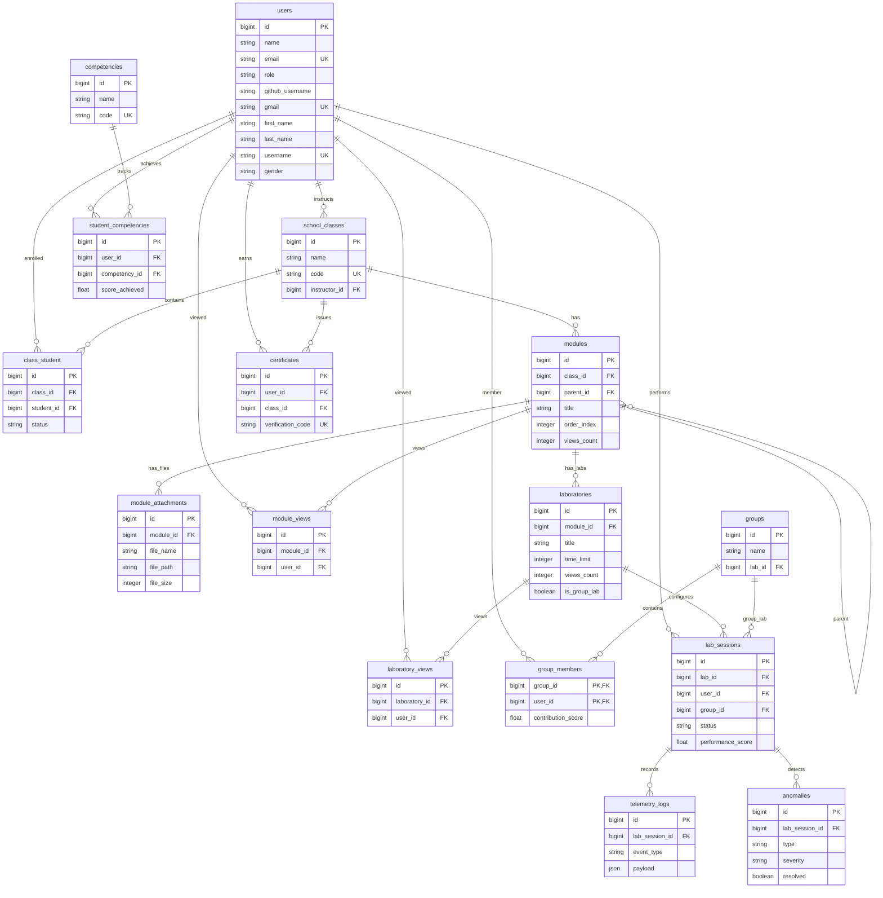

# Certicode Labs - Database ERD Instructions

This document provides complete instructions and source definitions to generate and visualize the Entity Relationship Diagram (ERD) for the **Certicode Labs** database. 

The database is built on **Laravel 12** and runs on **SQLite** (development) / **PostgreSQL** (production).

---

> [!TIP]
> **Quick Visualization:** You can view the embedded Mermaid diagram directly in GitHub or any Markdown editor with Mermaid support (like VS Code with the Mermaid Preview extension).
> For an interactive, editable diagram, use the **dbdiagram.io** source code below.

---

## Method 1: Interactive ERD via dbdiagram.io (Recommended)

[dbdiagram.io](https://dbdiagram.io/) is a free database design tool. It allows you to visualize, edit, and export diagrams as PDF, SVG, or PNG using DBML (Database Markup Language).

### Instructions
1. Open [dbdiagram.io](https://dbdiagram.io/).
2. Delete any default code in the left panel.
3. Copy the DBML code block below and paste it into the editor.
4. The interactive diagram will generate instantly in the right panel. You can drag tables to arrange them.

### DBML Source Code
```dbml
// === Certicode Labs DBML Schema ===

Table users {
  id bigint [pk, increment]
  name varchar [note: "Full name of the user"]
  email varchar [unique]
  email_verified_at timestamp [null]
  password varchar
  role varchar [default: "student", note: "student, instructor, admin"]
  github_username varchar [null]
  gmail varchar [unique, null]
  gmail_verified_at timestamp [null]
  gmail_verification_code varchar [null]
  notify_class boolean [default: true]
  notify_module boolean [default: true]
  notify_lab boolean [default: true]
  notify_certificate boolean [default: true]
  notify_email_channel boolean [default: true]
  first_name varchar [null]
  last_name varchar [null]
  username varchar [unique, null]
  gender varchar [null]
  remember_token varchar [null]
  created_at timestamp
  updated_at timestamp
}

Table school_classes {
  id bigint [pk, increment]
  name varchar
  code varchar [unique, note: "Join Code"]
  instructor_id bigint [ref: > users.id]
  description text [null]
  created_at timestamp
  updated_at timestamp
}

Table class_student {
  id bigint [pk, increment]
  class_id bigint [ref: > school_classes.id]
  student_id bigint [ref: > users.id]
  status varchar [default: "enrolled", note: "enrolled, invited"]
  created_at timestamp
  updated_at timestamp
  
  Indexes {
    (class_id, student_id) [unique]
  }
}

Table modules {
  id bigint [pk, increment]
  class_id bigint [ref: > school_classes.id]
  parent_id bigint [ref: > modules.id, null]
  title varchar
  description text [null]
  content text [null, note: "Lesson content"]
  order_index integer [default: 0]
  views_count integer [default: 0]
  created_at timestamp
  updated_at timestamp
}

Table module_attachments {
  id bigint [pk, increment]
  module_id bigint [ref: > modules.id]
  file_name varchar
  file_path varchar
  file_size integer [default: 0]
  created_at timestamp
  updated_at timestamp
}

Table module_views {
  id bigint [pk, increment]
  module_id bigint [ref: > modules.id]
  user_id bigint [ref: > users.id]
  created_at timestamp
  updated_at timestamp
  
  Indexes {
    (module_id, user_id) [unique]
  }
}

Table laboratories {
  id bigint [pk, increment]
  module_id bigint [ref: > modules.id, null]
  title varchar
  description text
  github_repo_template varchar [null]
  tasks_definition json [null]
  time_limit integer [default: 60]
  views_count integer [default: 0]
  is_group_lab boolean [default: false]
  created_at timestamp
  updated_at timestamp
}

Table laboratory_views {
  id bigint [pk, increment]
  laboratory_id bigint [ref: > laboratories.id]
  user_id bigint [ref: > users.id]
  created_at timestamp
  updated_at timestamp
  
  Indexes {
    (laboratory_id, user_id) [unique]
  }
}

Table groups {
  id bigint [pk, increment]
  name varchar
  lab_id bigint [ref: > laboratories.id]
  created_at timestamp
  updated_at timestamp
}

Table group_members {
  group_id bigint [ref: > groups.id]
  user_id bigint [ref: > users.id]
  contribution_score float [null]
  created_at timestamp
  updated_at timestamp
  
  Indexes {
    (group_id, user_id) [pk]
  }
}

Table lab_sessions {
  id bigint [pk, increment]
  lab_id bigint [ref: > laboratories.id]
  user_id bigint [ref: > users.id]
  group_id bigint [ref: > groups.id, null]
  github_repo_url varchar [null]
  started_at timestamp [null]
  ended_at timestamp [null]
  status varchar [default: "in_progress", note: "in_progress, completed, flagged, abandoned"]
  completed_tasks json [null]
  performance_score float [default: 0.0]
  created_at timestamp
  updated_at timestamp
}

Table telemetry_logs {
  id bigint [pk, increment]
  lab_session_id bigint [ref: > lab_sessions.id]
  event_type varchar [note: "tab_switch, idle, code_paste, webcam_check, command, etc."]
  payload json [null]
  created_at timestamp [default: `now()`]
}

Table anomalies {
  id bigint [pk, increment]
  lab_session_id bigint [ref: > lab_sessions.id]
  type varchar [note: "no_face, multiple_faces, excessive_tab_switch, low_contribution, etc."]
  severity varchar [default: "low", note: "low, medium, high"]
  description text [null]
  resolved boolean [default: false]
  created_at timestamp
  updated_at timestamp
}

Table competencies {
  id bigint [pk, increment]
  name varchar
  code varchar [unique, note: "e.g., COMP-LINUX-01"]
  created_at timestamp
  updated_at timestamp
}

Table student_competencies {
  id bigint [pk, increment]
  user_id bigint [ref: > users.id]
  competency_id bigint [ref: > competencies.id]
  score_achieved float [default: 0.0]
  created_at timestamp
  updated_at timestamp
}

Table certificates {
  id bigint [pk, increment]
  user_id bigint [ref: > users.id]
  class_id bigint [ref: > school_classes.id]
  verification_code varchar [unique]
  qr_code_path varchar [null]
  issued_at timestamp [default: `now()`]
  created_at timestamp
  updated_at timestamp
}

Table notifications {
  id uuid [pk]
  type varchar
  notifiable_type varchar
  notifiable_id bigint
  data text
  read_at timestamp [null]
  created_at timestamp
  updated_at timestamp
}
```

---

## Method 2: Native Mermaid.js Diagram

This diagram renders directly inside markdown engines that support Mermaid.



---

## Method 3: Programmatic Generation from Laravel Code

You can automatically generate an ERD image (`.png`, `.svg`) directly from the Laravel models using the `beyondcode/laravel-er-diagram-generator` package.

### Step 1: Install Graphviz (System Requirement)
The generator package requires **Graphviz** to render the diagrams.
- **Windows**: Install via winget or Chocolatey:
  ```powershell
  winget install Graphviz
  ```
- **macOS**: Install via Homebrew:
  ```bash
  brew install graphviz
  ```
- **Linux**: Install via apt/yum:
  ```bash
  sudo apt-get install graphviz
  ```

### Step 2: Install Laravel Package
Run composer in the project root:
```bash
composer require beyondcode/laravel-er-diagram-generator --dev
```

### Step 3: Run Generation Command
To generate the diagram as a `.png` file:
```bash
php artisan generate:erd erd.png
```
Or as an `.svg` vector image:
```bash
php artisan generate:erd erd.svg
```

> [!NOTE]
> The package automatically scans your models in `app/Models/` and detects relationships (`hasMany`, `belongsTo`, etc.) to build the layout.

---

## Data Dictionary & Key Reference

### 1. User & Enrollment Management
* **`users`**: Contains students, instructors, and admins. Integrates OAuth (GitHub) and verification channels (Gmail).
* **`school_classes`**: Created by instructors. Features a join `code` for student self-enrollment.
* **`class_student`**: Pivot representing student enrollment in classes. Status tracks whether they are `enrolled` or just `invited` via email.

### 2. Curriculum Structure
* **`modules`**: Topics inside a class. Supports nested structure via `parent_id` (self-relation) for sub-topics.
* **`module_attachments`**: Files uploaded to a module (PDFs, guides, attachments).
* **`laboratories`**: Virtual labs associated with modules. Contains task definitions (checklists/validation scripts).

### 3. Lab Activity & Tracking
* **`lab_sessions`**: Single student (or group) lab attempt. Tracks status, repo URL, start/end times, and scores.
* **`groups`**: Collaborative teams formed for `is_group_lab` labs.
* **`group_members`**: Pivot connecting users to groups. Tracks individual contribution scores.
* **`telemetry_logs`**: Logs active events during a lab session (idle, copy-pastes, cmd line runs, tab switches) for cheating/activity analysis.
* **`anomalies`**: Proctors flags (tab switching, no face, low participation).

### 4. Achievements & Credentials
* **`competencies`**: Skills/competency categories indexed by unique tags (e.g. `COMP-LINUX-01`).
* **`student_competencies`**: Tracks student mastery levels/grades in specific competencies.
* **`certificates`**: Digital verifiable credentials issued when students complete classes. Features unique validation codes and QR paths.
* **`notifications`**: Polymorphic system notification logs.
